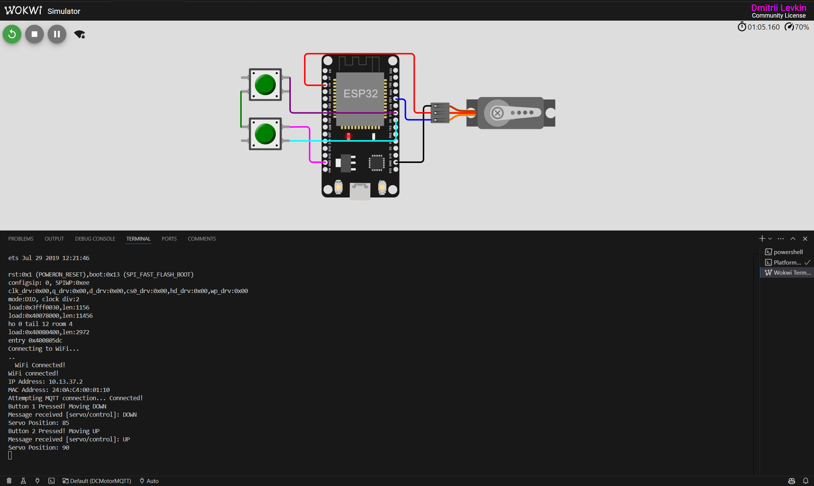

# ESP32 MQTT Servo Control

This project demonstrates how to control a servo motor using an ESP32 with MQTT messaging. It connects to WiFi, subscribes to an MQTT topic, and moves the servo based on received messages or button presses. The project was developed using the Wokwi simulator for Visual Studio Code.

### **Features**
  - Connects ESP32 to WiFi and an MQTT broker.
  - Uses PubSubClient for MQTT communication.
  - Controls a servo motor via MQTT messages (UP / DOWN).
  - Uses two buttons to manually send MQTT messages.
  -Developed and tested in Wokwi Simulator.

### **Components Used**
- ESP32
- Servo Motor (connected to GPIO 21)
- Two Push Buttons (GPIO 18 & GPIO 5)
- WiFi & MQTT Connectivity
- Wokwi Virtual Hardware Simulation


 ()
  


### **How to Contribute**
1. Fork the repository.
2. Clone your forked repository:
```bash
git clone https://github.com/Levantosina/ESP32-MQTT-Servo-Control.git
```
3. Install Required Libraries
- WiFi.h (ESP32 built-in WiFi library)
- PubSubClient.h (for MQTT communication)
- ESP32Servo.h (to control the servo motor)
4. Open the Project in Wokwi
- Install Wokwi Extension in Visual Studio Code. (https://docs.wokwi.com/vscode/getting-started)
- 
5. Upload and Run the Code


### **Expected Behavior**
- The servo starts at 90 degrees.
- Receiving an UP message increases the angle by 5 degrees (up to 180).
- Receiving a DOWN message decreases the angle by 5 degrees (down to 0).
- Button presses also trigger MQTT messages and move the servo accordingly.

### **Contact**

If you have questions or suggestions, feel free to reach out:

- **Email**: levantosina1992@gmail.com
- **GitHub**: (https://github.com/levantosina)